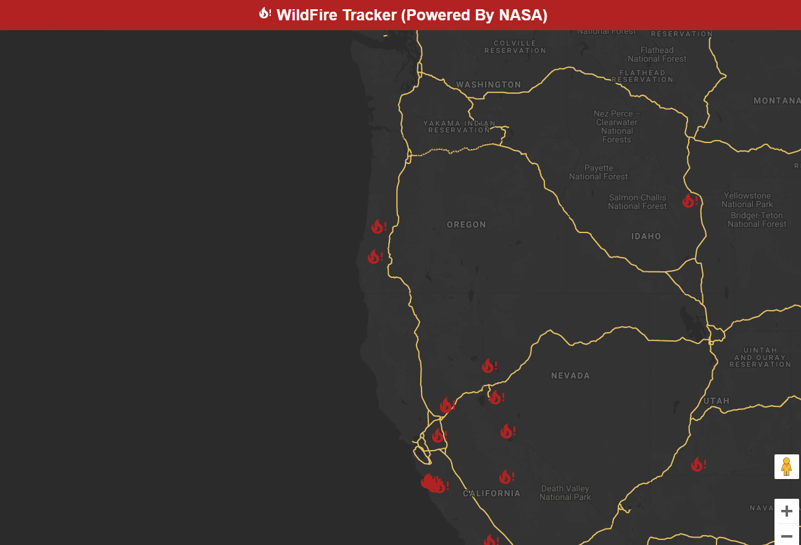

# Getting Started with Create React App

This project was bootstrapped with [Create React App](https://github.com/facebook/create-react-app).

## Available Scripts

In the project directory, you can run:

### `npm start`

Runs the app in the development mode.\
Open [http://localhost:3000](http://localhost:3000) to view it in the browser.

---

# Wildfire Tracker Application

This app is a React based application that's fetching data from the events object API endpoint from NASA's open EONET API. It contains all closed events from the past 150 days for demo purposes.

---

To check out the different data you can pull see NASA's API.

[NASA's API](https://eonet.sci.gsfc.nasa.gov/docs/v2.1)

## Screenshots

